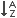
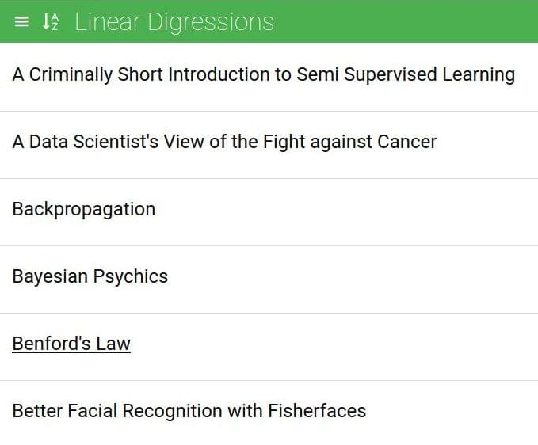
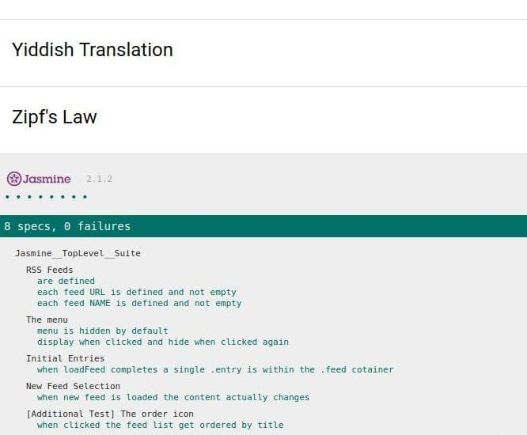

FeedReader {FeedReader Test Project}
===============================
The **FeedReader** project has the goal to test some features (seven mandatory tests) of a given project. One more opional test has been added. All the tests are performed using the framework [Jasmine](http://jasmine.github.io/). The main files are: the application JS file `app.js`, the HTML file `index.html` and the tests JS file `feedreader.js`. I have modified the `app.js` and `index.html` files to add a new feature that it allows to order lexicographically pressing the button  the feed list elements on the page by title, this feature is implemented (in the file `app.js` the function `orderIcon.on('click', function()`) and tested (the eighth test).

Download:
===============================
`$ git clone https://github.com/svankj/frontend-nanodegree-feedreader.git`

How to run:
===============================
Launch the web server, or similar, `SimpleHTTPServer` (e.g. `python -m SimpleHTTPServer 8000`) from terminal opened in the project directory. In the same directory from another terminal digit `.ngrok http 8000`. Copy the url generated and paste it in the browser (e.g. `Chrome`).

Dev Tools:
===============================
The projetc has been developed using:
*	*OS Ubuntu 14.04 LTS* (*Trusty Tahr*)
*	Browser *Chromium*/*Chrome*
*	*Sublime Text*
*	*Haroopad* to write the documentation README.md file

Project folders:
*	`/src/` contains:
	* 	`css/style.css, css/icomoon.css, css/normalize.css` the css files readable
	* 	`fonts/` fonts folder
	* 	`js/app.js` the application JS readable
	* 	`index.html` the readable HTML file
	* 	`jasmine/lib/` Jasmine Library
	* 	`spec/feedreader.js` Jasmine tests file readable
*	`/dist/` contains:
	*	`css/style.css, css/icomoon.css, css/normalize.css` the css minify files
	*	`fonts/` fonts folder
	*	`js/app.js` the application minify JS
	*	`index.html` the minify HTML file
	*	`jasmine/lib/` Jasmine Library
	*	`spec/feedreader.js` Jasmine tests minify file
*	main directory contains:
	*	`README.md` the README file, documentation file
	*	`/doc/` images for README file
	*	`/dist/` directory
	*	`/src/` directory

Tests performed
===============================

1.	**It tests to make sure that the `allFeeds` variable has been defined and that it is not empty.**
    First test for free, already done as example.
2.	**Write a test that loops through each feed in the `allFeeds` object and ensures it has a URL defined and that the URL is not empty.**
    This test through the iteration `allFeeds.forEach` checks that every feed URL has defined:
	```javascript
    expect(element.url).toBeDefined();
    ```
    and it is not empty:
    ```javascript
    expect(element.url).not.toEqual("");
    ```
3.	**Write a test that loops through each feed in the `allFeeds` object and ensures it has a name defined and that the name is not empty.**
	This test through the iteration `allFeeds.forEach` checks that every feed name has defined:
	```javascript
    expect(element.name).toBeDefined();
    ```
    and it is not empty:
    ```javascript
    expect(element.name).not.toEqual("");
    ```
4.	**Write a test that ensures the menu element is hidden by default.**
	This test checks if at the beginning by default the menu element is hidden, in other words if the class `menu-hidden` has set in the `body`:
	```javascript
    expect(element.getAttribute('class') === 'menu-hidden').toBeTruthy();
    ```
5.	**Write a test that ensures the menu changes visibility when the menu icon is clicked. This test should have two expectations: does the menu display when clicked and does it hide when clicked again.** 
	This test sets as starting condition the menu hidden:
	```javascript
	 $('body').addClass('menu-hidden');
     ```
     then trigger the click event:
	```javascript
	$('.menu-icon-link').trigger('click');
    ```
    two times: one to test the menu showed:
    ```javascript
    expect(element.getAttribute('class') === 'menu-hidden').toBeFalsy();
    ```
    and the other the menu hidden:
    ```javascript
    expect(element.getAttribute('class') === 'menu-hidden').toBeTruthy();
    ```
6.	**Write a test that ensures when the `loadFeed` function is called and completes its work, there is at least a single `.entry` element within the `.feed` container.**
	This test calls the `loadFeed` function to get some elements and it waits for the loading end `done()`
	```javascript
    beforeEach(function (done) {
    	var error = loadFeed(0, function () {
    ```
    then it can verify if there are `entry` elements in the `.feed` container
    ```javascript
    expect($('.feed').find('.entry').length).toBeGreaterThan(0);
    ```
7.	**Write a test that ensures when a new feed is loaded by the `loadFeed` function that the content actually changes.**
	This test starts loading a first set of `.entry` elements calling `loadFeed` function and waiting for job done, saving the HTML `.feed` container
    ```javascript
    beforeEach(function (done) {
    	var error = loadFeed(1, function () {
    		feedFirstUpdate = $('.feed').html();
    ```
	then it calls again the `loadFeed` function waiting for its completion and saving the new HTML `.feed` container, the `beforeEach` will be called in the order they're defined.
    ```javascript
    beforeEach(function (done) {
    	if(isOk) {
    		var error = loadFeed(2, function () {
    			feedSecondUpdate = $('.feed').html();
    ```
    then it has to check if the two HTML saved are different
    ```javascript
    expect(feedFirstUpdate).not.toEqual(feedSecondUpdate);
    ```
8.	**My Additional Test.** I have implemented a new feature to test. Pressing the button  (the icon as the other is added using [Icomoon](https://icomoon.io/)) on the top left of the page, the feed list in the page gets ordered by title. The test just checks if the content of the page after pressing the button gets ordered as it should be. The test simply checks if every elements on the page is ordered by title two at the time.
First of all it loads a new feed list calling the `loadFeed` function and then trigger the click event of order button
	```javascript
    beforeEach(function (done) {
    	var error = loadFeed(3, function () {
    		$('.order-icon-items').trigger('click');
    		isOk = (error.statusText === 'OK')?true:false;
    		done();
    ```
Then looping through each article element comparing two elements at the time to verify the lexicographically order by the title
	```javascript
    $('article').each(function (index, value) {
    	expect($(oldValue).find('h2').text().toLowerCase()).toBeLessThan($(value).find('h2').text().toLowerCase());
    	oldValue = value;
    });
	```
9.	**A note** on the errors if the case of ajax call failing, the `loadFeed` function returns the error
	```javascript
    var error = loadFeed(3, function () {
    ```
    so in the test suite it is possible to handle this kind of error
    ```javascript
    isOk = (error.statusText === 'OK')?true:false;
    ```
    and to throw the error in the right place
    ```javascript
    throw new Error("JQuery Call didn't send back any data");
    ```

FeedReader Guide
===============================
 `Screencaps` | `Notes`
--- | ---
[](doc/01.jpg) | The main page including the required tests, near the burger icon the new button pressing it the feed list on the page has ordered lexicographically by the title.
[](doc/02.jpg) | All the seven required tests are passed plus the optional one added, if the ajax call doesn't work the error is handled and a message is displayed in the related test result, otherwise the general result should be `8 specs, 0 failures`.

License
===============================
>MIT License

>Copyright (c) 2016 svankj

>Permission is hereby granted, free of charge, to any person obtaining a copy
of this software and associated documentation files (the "Software"), to deal
in the Software without restriction, including without limitation the rights
to use, copy, modify, merge, publish, distribute, sublicense, and/or sell
copies of the Software, and to permit persons to whom the Software is
furnished to do so, subject to the following conditions:

>The above copyright notice and this permission notice shall be included in all
copies or substantial portions of the Software.

>THE SOFTWARE IS PROVIDED "AS IS", WITHOUT WARRANTY OF ANY KIND, EXPRESS OR
IMPLIED, INCLUDING BUT NOT LIMITED TO THE WARRANTIES OF MERCHANTABILITY,
FITNESS FOR A PARTICULAR PURPOSE AND NONINFRINGEMENT. IN NO EVENT SHALL THE
AUTHORS OR COPYRIGHT HOLDERS BE LIABLE FOR ANY CLAIM, DAMAGES OR OTHER
LIABILITY, WHETHER IN AN ACTION OF CONTRACT, TORT OR OTHERWISE, ARISING FROM,
OUT OF OR IN CONNECTION WITH THE SOFTWARE OR THE USE OR OTHER DEALINGS IN THE
SOFTWARE.

About me
===============================
 | `svanky is a Freelance Developer`
--- | ---
 	|